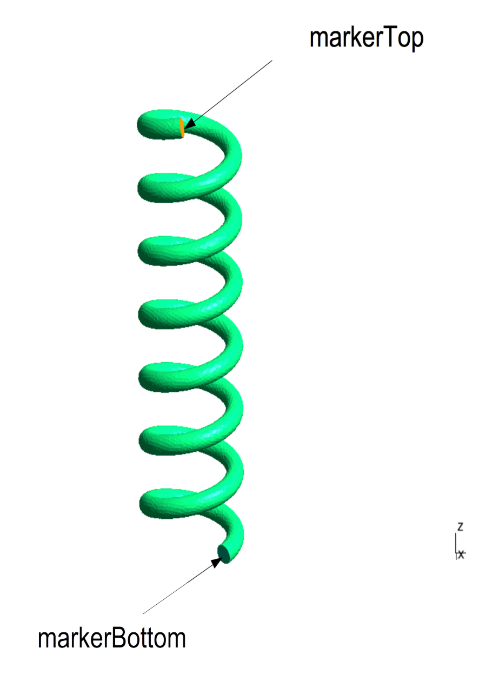

= Spring Model

== Generating the geometry

----
sh runpipeline.sh --angiotk <location of {angiotk} executables> --cfg <location of {angiotk} config files>
----

In docker, the results of the pipeline are stored in `/feel/angiotk/spring`.
Once the files are generated you are ready to use {feelpp} toolboxes

== {feelpp} toolboxes

We consider a 3D spring generated by {angiotk} and would like to use the {feelpp} CSM and CFD toolboxes

=== CFD

* Model: Stokes

The command to execute the testcase reads
----
mpirun -np 4 feelpp_toolbox_cfd_3d --config-file cfd/cfd.cfg
----

=== CSM

* Model: Linear Elasticity
* Material : steel
** `marker`: `volumeSpring`
** stem:[rho=7850]
** stem:[E=210e6]
** stem:[nu=0.33]
* consider gravity using stem:[(0,0,-rho*g)] with stem:[g=9.80665]

==== Test case 1

The objective is to stretch the spring and get the steady state displacement.

* Boundary conditions:
** `markerBottom`: `disp={0,0,-dispImposed}` with `dispImposed=8e-3`
** `markerTop`: `disp={0,0,0}`
** remaining parts are constraints free

[NOTE]
====
We use a quasi-static algorithm to reach the steady-state with a time increment of stem:[1e-3].
We also save the solution to use it in the next testcase
====

----
mpirun -np 4 feelpp_toolbox_csm_3d --config-file csm/spring.cfg
----

==== Test case 2

The objective is to study the dynamics of a spring starting from the stretching obtained in previous testcase

* Boundary conditions:
** `markerTop`: `disp={0,0,0}`
** remaining parts are constraints free
* time scheme:
** Delta T = 1e-3 s
** T final = 0.2 s

[NOTE]
====
To define the initial displacement stem:[u] à stem:[t=0] from the saved solution of the previous testcase, you have to add the following option in the config file:
 
----
solid.time-initial.displacement.files.directory=$repository/angiotk/spring/feelpp/csm/exercise1/P1G1/np_4/solution.displacement
----
You have to use the same partitioned mesh, here we used 4 processors

The command to execute the testcase reads
----
mpirun -np 4 feelpp_toolbox_csm_3d --config-file csm/spring2.cfg
----

